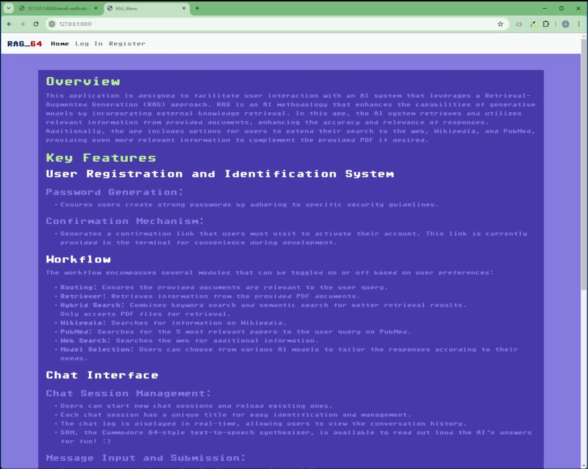
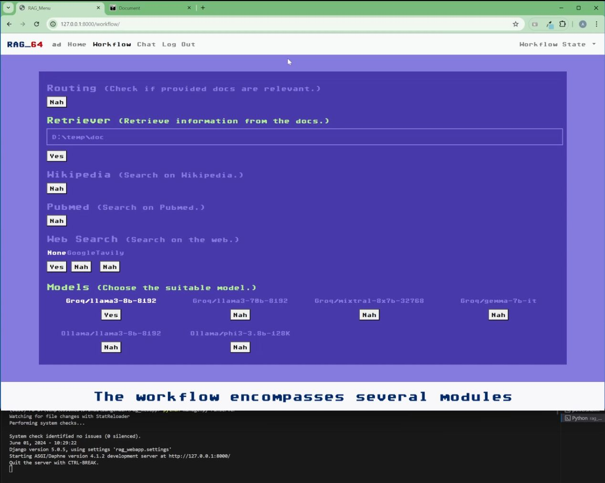
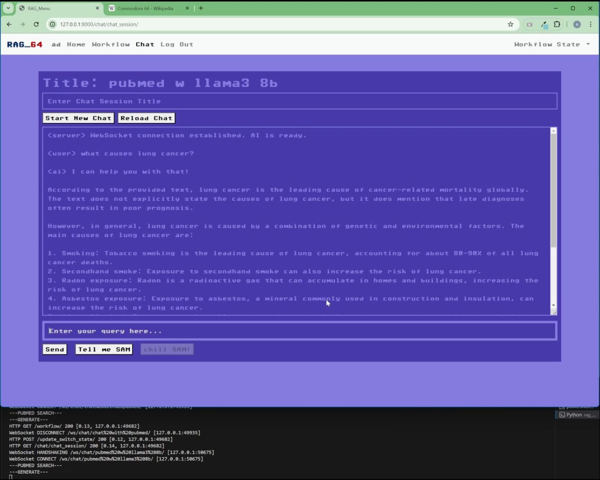

<h1 align="center"> 
  RAG_64 Application
   
</h1>

<h4 align="center">A web application in a Commodore 64 style to chat with documents from sources like PDFs, Wikipedia, PubMed, and web searches using local and online LLM models.</h4>

  <a href="#application-summary">Application Summary</a> •
  <a href="#key-features">Key Features</a> •
  <a href="#how-to-use">How To Use</a> •
  <a href="#technical-notes">Technical Notes</a> •
  <a href="#disclaimer">Disclaimer</a>

Full video link: <a href="https://youtu.be/rj17jFagP0Q">https://youtu.be/rj17jFagP0Q</a>

## Application Summary

### Overview
This application is designed to facilitate user interaction with an AI system that leverages a Retrieval-Augmented Generation (RAG) approach. RAG is an AI methodology that enhances the capabilities of generative models by incorporating external knowledge retrieval. In this app, the AI system retrieves and utilizes relevant information from provided documents and online sources, enhancing the accuracy and relevance of responses.

- **User Registration and Identification System**
  - **Password Generation**: Ensures users create strong passwords by adhering to specific security guidelines.
  - **Confirmation Mechanism**: Generates a confirmation link that users must visit to activate their account. This link is currently provided in the terminal for convenience during development.
  
- **Chat Interface**
  - **Chat Session Management**:
    - Users can start new chat sessions and reload existing ones.
    - Each chat session has a unique title for easy identification and management.
    - The chat log is displayed in real-time, allowing users to view the conversation history.
  - **Message Input and Submission**:
    - Users can enter their queries in the message input field.
    - Messages are sent to the AI system via a WebSocket connection, ensuring real-time interaction.

### Workflow
The workflow encompasses several modules that can be toggled on or off based on user preferences:
- **Routing**: Ensures the provided documents are relevant to the user query.
- **Retriever**: Retrieves information from the provided PDF documents.
  - Only accepts PDF files for retrieval.
- **Hybrid Search**: Combines keyword search and semantic search for better retrieval results.
- **Wikipedia**: Searches for information on Wikipedia.
- **PubMed**: Searches for the 5 most relevant papers to the user query on PubMed.
- **Web Search**: Searches the web for additional information.
- **Model Selection**: Users can choose from various AI models to tailor the responses according to their needs.

The "Workflow State" dropdown in the upper right corner shows the latest updated workflow. A workflow is updated when the user opens the "Chat" page. 

### Chat Interface

- **Chat Session Management**:
  - Users can start new chat sessions and reload existing ones.
  - Each chat session has a unique title for easy identification and management.
  - The chat log is displayed in real-time, allowing users to view the conversation history.
- **Message Input and Submission**:
  - Users can enter their queries in the message input field.
  - Messages are sent to the AI system via a WebSocket connection, ensuring real-time interaction.

### Technical Implementation

- **Frontend**:
  - HTML and JavaScript are used to create a dynamic and interactive user interface.
  - Real-time updates are facilitated through WebSocket connections.
  - CSS is used to style the interface and ensure a user-friendly experience.
  
- **Backend**:
  - The backend handles user registration, chat session management, and communication with the AI system.
  - AJAX is used to send asynchronous requests and update the switch states for various workflow modules.
  - CSRF tokens ensure secure AJAX requests.

### User Workflow

- **Creating the workflow**:
  - Click on the options to include them in the workflow
  - Choose the desired LLM
  - Go to the "Chat" page

- **Starting a New Chat**:
  - Enter a chat session title in the input field and click "Start New Chat" or press "Enter".
  - The chat log is cleared, and a new WebSocket connection is established.
  - The user can start typing messages once the connection is established.
  
- **Sending a Message**:
  - Type a message in the message input field.
  - Click "Send" or press "Enter" to send the message to the AI.
  - Use the "Tell me SAM" button to read aloud the response and stop it with the "chill SAM!" button. 
  - The message is displayed in the chat log, and a loader is shown while waiting for a response.
  
- **Reloading a Chat Session**:
  - Enter the chat session title in the input field and click "Reload Chat".
  - The system fetches the chat history from the server and displays it in the chat log.

### Conclusion
This application provides a comprehensive platform for users to interact with an AI system through a structured and feature-rich interface. By incorporating RAG methodology and hybrid search techniques, the app ensures that users receive accurate and relevant responses to their queries. The user-friendly interface, combined with robust backend functionality, makes this application a powerful tool for information retrieval and interaction.

## Key Features

### AI Answering Workflow Control Page
This HTML template serves as the user interface for controlling the workflow of the AI answering process. It allows the user to toggle various switches and choose options related to the workflow process. Below is a breakdown of the components:

- **Routing Switch**: This switch controls whether the provided documents are checked for relevance. If enabled, the system checks if the documents are relevant to the user's query.
- **Retriever Switch**: This switch toggles the retrieval of information from PDF documents. When enabled, the system extracts relevant information from PDF files provided by the user.
- **Wikipedia Switch**: This switch enables or disables searching for information on Wikipedia related to the user's query.
- **PubMed Switch**: This switch enables or disables searching for information on PubMed. When enabled, the system selects the 5 most relevant papers from the PubMed website based on the user's query.
- **Web Search Switch**: This switch allows the user to choose the preferred web search engine: Google or Tavily. Alternatively, the user can select 'None' to disable web searching.
- **Models**: This section provides options to choose from different language models for processing the user's query and documents. Options include various models like Groq/llama3-8b-8192, Groq/llama3-70b-8192, Groq/mixtral-8x7b-32768, Groq/gemma-7b-it, Ollama/llama3-8b-8192, and Ollama/phi3-mini-128K.

Users can interact with the switches and options to customize the workflow according to their preferences. Upon interaction, the system sends AJAX requests to update the switch states and retrieve relevant information based on the user's selections.

### Chat Session Interface
This HTML template provides an interface for starting and managing chat sessions with an AI. It includes features for initiating new chat sessions, reloading previous sessions, and sending messages through a WebSocket connection. The interface is designed to be user-friendly and interactive, allowing users to easily communicate with the AI. Below is a detailed description of the components and functionality:

#### Components

- **Chat Session Title Input**:
  - An input field where the user can enter a title for the new chat session. This title is used to identify the session.
  - When the "Enter" key is pressed, it triggers the start of a new chat session.
  
- **Start New Chat Button**:
  - A button that initiates a new chat session using the title provided by the user.
  - Establishes a new WebSocket connection and resets the chat log.
  
- **Reload Chat Button**:
  - Allows the user to reload a previous chat session using the provided session title.
  - Fetches and displays the chat history from the server.
  
- **Chat Log**:
  - A textarea that displays the messages exchanged during the chat session.
  - It is disabled for direct editing to maintain the integrity of the chat history.
  
- **Message Input**:
  - An input field for typing messages to send to the AI.
  - Disabled initially and enabled when the WebSocket connection is established.
  
- **Send Button**:
  - Sends the typed message to the AI when clicked.
  - It is disabled initially and enabled once the WebSocket connection is established.
  
- **Loader**:
  - A loading indicator displayed when the system is processing or waiting for a response.

## How To Use

### Prerquisites

- Python >=3.11 (preferably with venv or conda)
- To use local LLMs Ollama with llama3 and phi3 mini installed (ollama pull llama3:latest, ollama pull phi3:mini) [Ollama](https://ollama.com/).
- To use Groq groq api key is required [Groq](https://console.groq.com/login).
- To use Tavily search tavily api key is required [Tavily](https://tavily.com/).
- To use google search [Google Programmable Search Engine](https://programmablesearchengine.google.com/).
- Update all necessary API keys in the consumers.py file within the "#API keys" section.
- PostgreSQL database; refer to the default details in the "rag_webapp/settings.py" in the `DATABASES` dictionary.
- Modules in the requirements.txt `pip install -r requirements.txt`
- After download or clone the repo start with migration `python manage.py migrate`
- To run the app locally, run `python manage.py runserver`

## Technical notes

- The AI part of the app is in the `llm.py` file. It uses [Langchain with Langgraph](https://python.langchain.com/v0.2/docs/introduction/) to build the workflow for RAG.
- For front-end and back-end communication, the [Django Channels](https://channels.readthedocs.io/en/latest/) module is utilized.
- The front-end behavior is handled by JS included in the HTML files themselves.
- The CSS styling, in general, is in the `style.css` file. The page-relevant CSS is mostly included in the page HTML file.
- SAM is a JS code found in the `samjs.js` file, [SAM Github repo](https://github.com/Imrane03/better-sam). I modified the code slightly to provide a "stop" functionality when the text synthesis is playing (refer to my code and comments in the file).

## Disclaimer

The app is mostly bug-free, but it was not unit tested, so it might have some nonetheless.